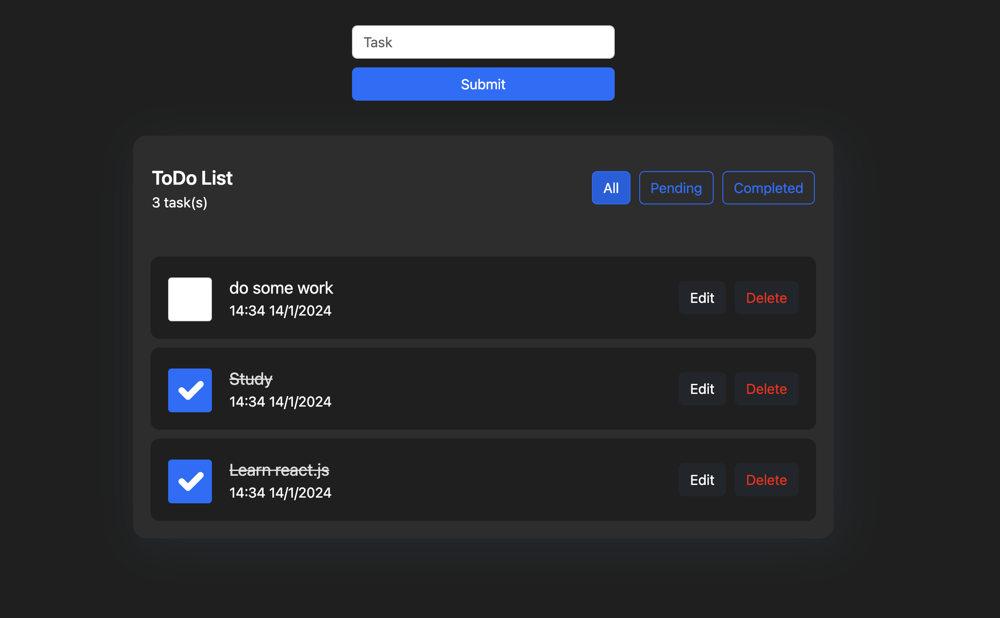

# React ToDo App

Live demo: 

A simple beginner friendly complete ToDo app which consists of all CRUD operations.

This project uses ReactJs, TypeScript, and Bootstrap components & icons for styling.

## Getting Started

First, run the development server:

```bash
npm run dev
# or
yarn dev
# or
pnpm dev
```

Open [http://localhost:3000](http://localhost:3000) with your browser to see the result.

